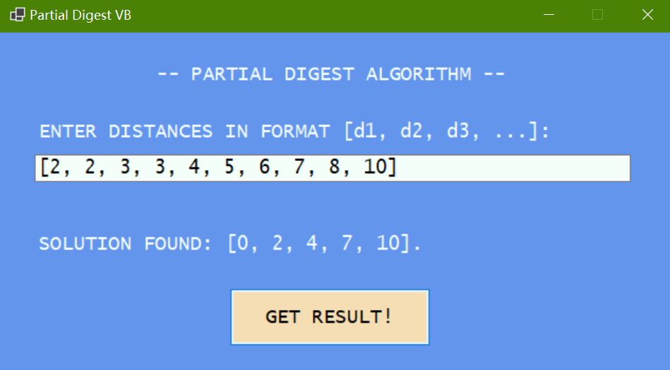

# Partial Digest Algorithm (VB.NET WinForms & Python)



## Description
This project implements the Partial Digest Algorithm (a.k.a. the PDP algorithm) in both VB.NET WinForms and Python. The PDP algorithm is a computational biology algorithm used to reconstruct a set of points from all pairwise distances between them - a common problem in bioinformatics for determining restriction site positions along DNA molecules.

### VB.NET Implementation
The VB.NET WinForms version was initially developed as a .NET 7.0 project based on an algorithm found in an extracurricular bioinformatics textbook. *__After upgrading to .NET 9.0, the implementation was successfully improved and refined.__* It features a user-friendly graphical interface where users can input distances and visualize the reconstructed points.

### Python Implementation
The Python version provides a command-line interface for the same algorithm, offering cross-platform compatibility and easy integration with other bioinformatics tools. It implements the same core logic as the VB.NET version while leveraging Python's concise syntax and powerful standard library.

## Prerequisites

### For VB.NET Version
- [**.NET SDK**](https://dotnet.microsoft.com/en-us/download/dotnet/9.0): version 9.0 or later
- **IDE**: Visual Studio 2022/2026 or Visual Studio Code

### For Python Version
- **Python**: version 3.7 or later

## Installation
1. Clone the repository or download the source code, then navigate to the project directory:
```bash
git clone https://github.com/Pac-Dessert1436/Partial-Digest-WinForms-Python.git
cd Partial-Digest-WinForms
```

### Running the VB.NET Version
2. Open the solution in Visual Studio 2022/2026, or the project folder in Visual Studio Code.
3. Build and run the project:
    - **Visual Studio 2022/2026**: Press "F5" or click "Start Debugging" from the "Debug" menu. You can also build the project first using the "Build" menu and then run the executable from `bin\Debug\net9.0-windows\`.
    - **Visual Studio Code**: Use these terminal commands:
    ```bash
    dotnet build
    dotnet run
    ```

### Running the Python Version
2. Ensure Python 3.7+ is installed on your system.
3. Run the Python script directly:
    ```bash
    python partial_digest.py
    ```

## Usage

### VB.NET WinForms Interface
1. Launch the application
2. Enter the fragment lengths in the input text box, in the format `[d1, d2, d3, ...]`
3. Click the "Get Result" button
4. View the reconstructed points in the output label

### Python Command-Line Interface
The Python version supports three modes of operation:

1. **Interactive input**:
   ```bash
   python partial_digest.py
   ```
   Then enter distances when prompted in the format `[d1, d2, d3, ...]`

2. **Command-line argument (list format)**:
   ```bash
   python partial_digest.py --input "[2, 2, 3, 3, 4, 5, 6, 7, 8, 10]"
   ```

3. **Command-line argument (space-separated)**:
   ```bash
   python partial_digest.py --distances 2 2 3 3 4 5 6 7 8 10
   ```

### Example
Input:
```
[2, 2, 3, 3, 4, 5, 6, 7, 8, 10]
```

Output:
```
Reconstructed points: [0, 2, 4, 7, 10]
Distances check: [2, 2, 3, 3, 4, 5, 6, 7, 8, 10]
```

## Personal Notes
The Partial Digest Algorithm is a fundamental tool in bioinformatics and computational biology. I first encountered it while studying an extracurricular bioinformatics textbook in the university library during my junior year. As mentioned earlier, my initial implementation wasn't successful until I revisited and improved it with .NET 9.0.

This project represents a personal exploration at the intersection of my academic background in Chinese Herbal Medicine and my short-term interest in computational biology. While I'm still considering whether to pursue bioinformatics more formally, role models like Mr. Zhou - a distinguished alumnus from Class 192 of Biotechnology - continue to inspire me.

I've faced persuasion to conform to certain expectations: my college counselor and family emphasize fitting in socially, while many in the coding community suggest focusing on C# over VB.NET. However, I'm grateful to Professor Li, dean of the Chinese Medicine Department, for encouraging me to follow my own path. She pointed to Mr. Wang, a lecturer in our department, who also works in computational biology using Python.

*__Python, C#, and VB.NET are my favorite tech stacks. This project demonstrates my ability to implement the same algorithm across different programming languages and platforms.__* Regardless of whether I conform to others' expectations, I'm determined to make the most of these tools to pursue my programming interests - whether they involve computational biology, bioinformatics, Traditional Chinese Medicine, or simply serve as a means of livelihood.

## License
This project is licensed under the MIT License. See the [LICENSE](LICENSE) file for details.